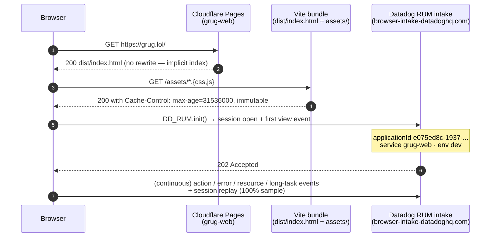
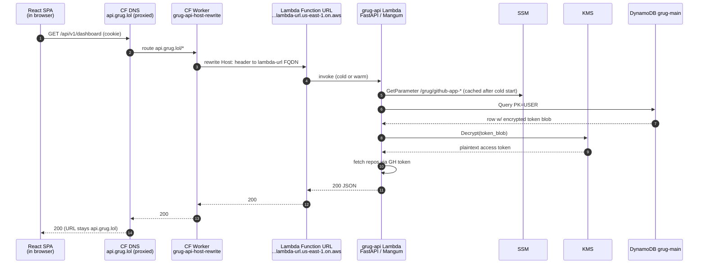
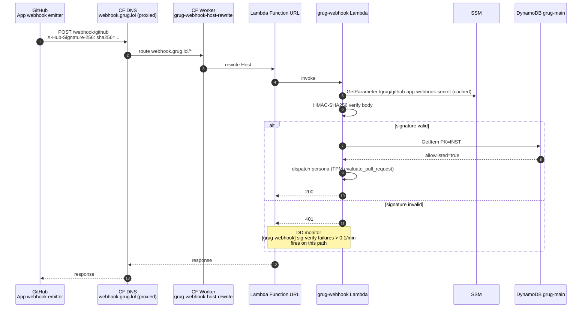
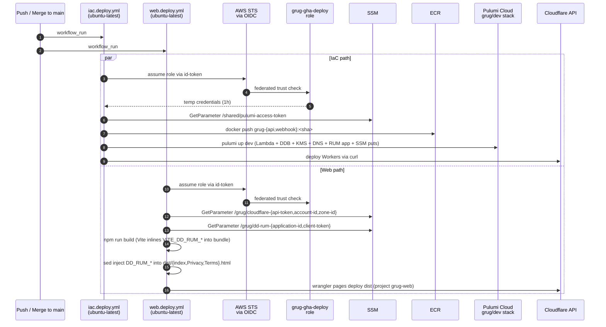
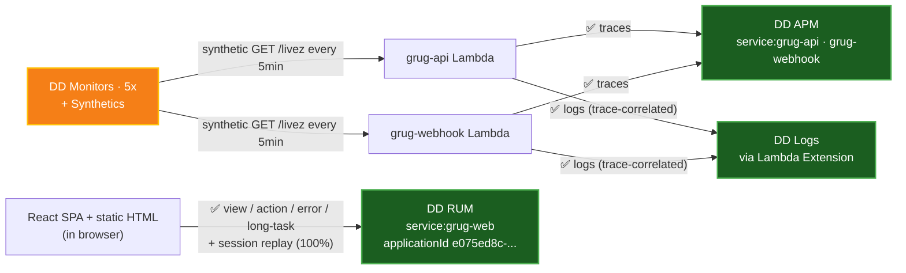

# Grug network topology

Mermaid's flowchart auto-layout produces overlapping edges on dense topologies — switching to **tables for static state** + **sequence diagrams for flows** (which render cleanly). Only the observability fan-out diagram (Section H) stays as a flowchart because the visual relationship is what's load-bearing.

> **Last meaningful update:** 2026-05-24 — RUM went live via spec 0013 (PRs #164, #166, #171); the observability matrix is now ✅ across all four pillars (APM + Logs + Monitors + RUM).

External SaaS the stack depends on (flat dependencies, not topology):

- **Cloudflare Pages** — `grug-web` project at apex `grug.lol` (static + SPA)
- **Cloudflare DNS + Workers** — proxied A records for `api.grug.lol` + `webhook.grug.lol`; two Host-rewrite Workers
- **AWS us-east-1** account `<aws-account-id>` — Lambda, DDB, KMS, SSM, ECR, CloudWatch Logs
- **Datadog US1** — APM + Logs + RUM + Monitors + Synthetics
- **GitHub** — App registration `grug-tribe` (webhook source + OAuth identity provider) + Actions OIDC (deploys)
- **Pulumi Cloud** — `<pulumi-org>/grug/{dev,prod}` stacks (no passphrase)

---

## A. Public surfaces — what each domain serves

| Surface | DNS | CF layer | Origin | Purpose |
|---|---|---|---|---|
| **Landing + SPA** | `grug.lol` | CF Pages (`grug-web` project, static assets + `_redirects`) | — | Marketing landing (static `index.html`) + React SPA at `/app.html` for `/signin`, `/dashboard`, `/admin` |
| **User API** | `api.grug.lol` | CF DNS proxied → CF Worker `grug-api-host-rewrite` | Lambda Function URL → `grug-api` | OAuth callback, dashboard reads/writes, repo config CRUD, admin endpoints |
| **GitHub webhook** | `webhook.grug.lol` | CF DNS proxied → CF Worker `grug-webhook-host-rewrite` | Lambda Function URL → `grug-webhook` | GitHub App webhook receiver — installations, PRs, check runs |

Stacks: `dev` (live), `prod` (locked, not yet cut over).

---

## B. AWS placement — what lives where

| Component | Resource | Notes |
|---|---|---|
| `grug-api` Lambda | `arn:aws:lambda:us-east-1:<aws-account-id>:function:grug-api` | arm64, 512MB, 15s timeout, container image from ECR. FastAPI via Mangum. DD Extension 96-next baked in |
| `grug-webhook` Lambda | `arn:aws:lambda:us-east-1:<aws-account-id>:function:grug-webhook` | Same shape; tighter DDB IAM scope (no token reads) |
| Function URLs | `:url:grug-api`, `:url:grug-webhook` | AuthType=NONE; CF is the trust boundary. api Lambda has CORS allow `https://grug.lol` |
| ECR repos | `grug-api`, `grug-webhook` | Private; 14d untagged GC |
| DynamoDB | `grug-main` | Single-table, PAY_PER_REQUEST |
| KMS CMK | `grug-tokens` | Envelope-encrypts OAuth tokens (api Lambda only) + Lambda env vars (both) |
| SSM `/grug/*` | App ID, private key, webhook secret, OAuth client id+secret, CF creds, DD notify handle, **DD RUM app ID + client token** (managed by Pulumi) | SecureStrings |
| SSM `/shared/*` | DD API key, DD APP key (`/shared/datadog-app-key/github-grug`), Pulumi access token | Cross-cutting; some managed by `infrastructure/pulumi/aws-cicd-bootstrap` |
| CloudWatch Logs | per-Lambda log group | DD Extension streams via Lambda layer |
| IAM | `grug-gha-deploy` role | OIDC trust for `githumps/grug` main + `feat/*` + `fix/*` + `hotfix/*` + `v*` tags |

---

## C. Landing-page request flow (`grug.lol/`)

Routing rules live in `web/public/_redirects`. **Cardinal rule (learned PR #160):** destinations must NOT end in `.html` — CF Pretty URLs 308-canonicalizes the dest, converting the 200 rewrite into a 301 redirect.

---

## D. User-API request flow (`api.grug.lol/api/v1/*`)

CORS: api Lambda allows `https://grug.lol` only (exact-origin required for `credentials: true`). Methods: GET / POST / PUT / DELETE. Headers: content-type, authorization.

---

## E. GitHub-webhook request flow (`webhook.grug.lol/webhook/github`)

Webhook never decrypts user tokens — uses GitHub App JWT (signed via `/grug/github-app-private-key`).

---

## F. Deploy plane — GHA OIDC → AWS + CF + DD

**Runner-swap gotcha** (memory: `feedback_runner_swap_check_preinstalled_tools`): when iac.deploy was swapped from `the self-hosted CI runner` to `ubuntu-latest` (PR #156), the workflow assumed `uv` was preinstalled — true for the self-hosted runner, false for ubuntu-latest. Pulumi silently no-op'd for 24h until PR #166 added an explicit `astral-sh/setup-uv` step.

---

## G. Trust boundaries

| Boundary | Outside | Inside | Mechanism |
|---|---|---|---|
| **Public → CF** | Internet | Cloudflare edge | TLS termination + WAF / bot mgmt at CF tier |
| **CF → AWS** | CF Workers | Lambda Function URL | Worker rewrites `Host:` header AND injects `X-Grug-CF-Secret` from a Worker secret binding sourced from SSM `/grug/cf-shared-secret`. Lambda middleware (`services/{api,webhook}/cf_auth.py`) validates the header on every non-`/livez` request via `hmac.compare_digest`; direct hits on the Function URL return 401. Spec 0014 (CfSharedSecret) encodes the contract. DD monitor `grug-cf-secret-mismatch` alerts on >1/min mismatches over 10min (catches rotation drift or direct probing) |
| **AWS → Lambda env vars** | Lambda env (plaintext to the function) | KMS-encrypted at rest | `env_vars_kms_key_arn=grug-tokens-cmk`. `kms:Decrypt` scoped via `kms:ViaService = lambda.us-east-1.amazonaws.com` so the perm can't be reused for other KMS resources |
| **api Lambda → user OAuth tokens** | DDB encrypted blob | Plaintext access/refresh token | KMS envelope decrypt. Only `grug-api` role has `kms:Decrypt` on `grug-tokens-cmk`. `grug-webhook` does NOT — webhook uses GitHub App JWT |
| **Webhook payload** | GitHub | grug-webhook handler | HMAC-SHA256 verify against `/grug/github-app-webhook-secret`. 401 on mismatch. DD monitor on >0.1/min |
| **User session** | Browser cookie | api.grug.lol handlers | Cookie issued by `/api/v1/auth/github/callback`. SameSite=Lax. CORS `allow_credentials=true` requires exact-origin (no `*`) — `https://grug.lol` enumerated |

---

## H. Observability fan-out (the one diagram where the picture is the point)

| Pillar | Status | Live evidence (2026-05-24) |
|---|---|---|
| **APM traces** | ✅ | `grug-api` 271 spans / 6h. `grug-webhook` 36 spans / 1h. FastAPI auto-instrumented. Source-code linking via `DD_GIT_*` env vars (full 40-char SHA — Greptile P1 PR #81). Inferred-spans pollution killed via `DD_TRACE_MANAGED_SERVICES=false` |
| **Logs** | ✅ | DD Extension 96-next baked into image. 47 logs / 1h with `service`/`env`/`version`/`host` + `trace_id`+`span_id` for click-through |
| **Monitors** | ✅ | 5: `[grug-webhook] 5xx > 1%`, `[grug-api] 5xx > 5%`, `[grug-webhook] sig-verify failures > 0.1/min`, `[grug] cold-start p99 > 3s`, synthetic uptime on both `/livez` every 5min |
| **RUM** | ✅ | App ID `e075ed8c-1937-4c39-b1f0-548ebdaf48e6`. Service tag `grug-web`. 100% session-replay sampling. SDK loaded on all 4 HTML surfaces (`web/app.html` SPA via `@datadog/browser-rum`; `web/public/{index,Privacy,Terms}.html` via CDN snippet). First session opened 2026-05-24 ~14:30 UTC after PR #171 cleared the IAM gate |

---

## I. Bridge components (load-bearing single points of failure)

| Component | Why load-bearing |
|---|---|
| CF Worker `grug-{api,webhook}-host-rewrite` | Every public API + webhook request transits these. Without the Host-rewrite, Lambda Function URL rejects the request. Managed out-of-band via `infra/cloudflare/deploy.sh` — `pulumi-cloudflare` WorkerScript has known idempotency bugs |
| `grug-tokens` KMS CMK | Single CMK for env-var encryption AND OAuth-token envelope encryption. Disable/wrong-region = every Lambda cold start fails to decrypt `DD_API_KEY` and dies. Inline policy uses `kms:ViaService = lambda.us-east-1.amazonaws.com` |
| `/grug/cloudflare-api-token` SSM | Web deploys read this at workflow time (NOT a GitHub Actions secret — intentional). Rotate via SSM put; no code changes |
| `/shared/datadog-app-key/github-grug` SSM | Per-project DD APP key. Needs `monitors_write` + `logs_read_data` + `rum_apps_read` + `rum_apps_write` + `product_analytics_apps_write` scopes — every scope earned a 403 during the RUM cascade until added |
| `grug-gha-deploy` IAM role | OIDC-trust-scoped to `githumps/grug`. Policy must allow `ssm:PutParameter` on `/grug/*` (added PR #171 after RUM `dd_rum` component became the first Pulumi-managed SSM writer) |
| `iam_propagation_wait` (`pulumiverse_time.Sleep`) | Gates resources whose create/update runs an upfront AWS auth check against a freshly-updated deploy-role policy, so the policy has ~45s to propagate. Threaded via an `iam_propagation_wait=` kwarg into the factories that create them (#172): **Lambda** Functions (`lambda_service` / `scheduled_lambda`, KMS encrypt check), **SSM Params** (`dd_rum`, `ssm:PutParameter` — the RUM cascade race), and **EventBridge rules** (`scheduled_lambda`, `events:TagResource` — the #261 poller race). Any new resource class that depends on a same-run role-policy grant should take the kwarg + add it to `opts.depends_on` (grep `iam_propagation_wait=`). |
| `DD Lambda Extension 96-next` (baked into ECR image) | Cold-start path loads this binary. Version bump = full image rebuild |

---

## J. Bootstrap order (cold-start, if rebuilding from zero)

1. **Manual SSM pre-load** — `docs/HITL_PREREQUISITES.md` lists every parameter that must exist before first `pulumi up`:
   - `/grug/github-app-{id,client-id,client-secret,private-key,webhook-secret}`
   - `/grug/cloudflare-{api-token,zone-id,account-id}`
   - `/grug/dd-notify-handle`
   - `/shared/datadog-api-key`, `/shared/datadog-app-key/github-grug` (with all 5 scopes: `monitors_write`, `logs_read_data`, `rum_apps_read`, `rum_apps_write`, `product_analytics_apps_write`)
   - `/shared/pulumi-access-token`
2. **Pulumi up** — creates: SSM references, ECR repos, OIDC role, KMS CMK, DDB table, both Lambdas (bootstrap image), Function URLs, CF DNS records, DD monitors, **DD RUM Application + `/grug/dd-rum-{application-id,client-token}` SSM**. Lambda invocations error until step 4 swaps the image.
3. **GH Actions sync** — `infrastructure/scripts/sync-gh-secrets.sh` pushes `grug-gha-deploy` role ARN → `AWS_DEPLOY_ROLE_ARN` repo var.
4. **First `iac.deploy.yml` run** — builds + pushes real ECR images, second `pulumi up` swaps `image_tag` from `"bootstrap"` to the commit SHA.
5. **First `web.deploy.yml` run** — runs `infra/cloudflare/pages-bootstrap.sh` ONCE to create the `grug-web` CF Pages project + apex domain attachment, then `wrangler pages deploy dist` ships the build (with `VITE_DD_RUM_*` env + sed-substituted static HTML).
6. **`infra/cloudflare/deploy.sh`** — deploys both `grug-{api,webhook}-host-rewrite` Workers + binds routes. Re-run after any Lambda Function URL host change (memory: `reference_lambda_function_url_host_volatile`).
7. **Manual GitHub App reg** — `https://github.com/settings/apps/grug-tribe` already exists; on a fresh tenant create a new App, set webhook URL = `https://webhook.<domain>/webhook/github`, setup URL = `https://<domain>/dashboard`, copy the App ID + private key into SSM (step 1).

---

## K. Outage / first-light history (lessons baked into IaC + specs)

| Date | Incident | Fix |
|---|---|---|
| 2026-05-07 | DD Lambda Extension synthesized `aws.lambda.url` phantom spans tagged with the Function URL FQDN as `service`, polluting the APM catalog | `DD_TRACE_MANAGED_SERVICES=false` on both Lambda env. Memory: `reference_dd_apm_asgi_resource_grouping` |
| 2026-05-17 | DD APP key leaked into `pulumi preview` output (unwrapped `aws.ssm.get_parameter().value`) | Every SSM read for a secret now `pulumi.Output.secret()`-wrapped before being passed to providers. Memory: `feedback_pulumi_preview_secret_leak_guard` |
| 2026-05-24 | Design handoff regressions on grug.lol — `/apps/grug` 404 + mailto: CTAs + URL slug `/Grug` | PRs #157 + #160 fixed the symptoms; spec 0012 (Landing) + 3 attesters now block this class of regression in CI |
| 2026-05-24 | DD APP key per-project SSM path — `/shared/datadog-app-key` cross-repo path was stale after rotation; every `pulumi up` 403'd | Split into `/shared/datadog-app-key/github-grug` so per-repo rotations don't clobber siblings (PR #155) |
| 2026-05-24 | iac.deploy silently no-op'd for 24h after the self-hosted → `ubuntu-latest` runner swap (PR #156) — workflow comment claimed `uv` was preinstalled (true for old runner, false for new) | PR #166 added `astral-sh/setup-uv@v5`. Memory: `feedback_runner_swap_check_preinstalled_tools` |
| 2026-05-24 | RUM first-light cascade — 5 sequential 403s as each layer surfaced its next missing permission: `rum_apps_*` scopes → `product_analytics_apps_write` scope → `ssm:PutParameter` on `/grug/*` → IAM propagation race | DD UI scope additions (×2) + PR #171 (deploy role grant) + one-shot re-trigger (IAM propagation). RUM live in DD ~14:30 UTC after the cascade cleared |

---

## L. Cross-references

- The operator's private infra repo holds the sibling cluster-topology + cross-repo Pulumi-project-graph docs (not linked from this public repo).
- [`docs/HITL_PREREQUISITES.md`](HITL_PREREQUISITES.md) — every SSM parameter that must exist before first `pulumi up`
- [`docs/RUNBOOK.md`](RUNBOOK.md) — operational procedures for live grug.lol
- [`specs/0012-landing/`](../specs/0012-landing/) — Landing IOA spec + 3 grounding attesters (CTAs, install URL, slug)
- [`specs/0013-rum-instrumentation/`](../specs/0013-rum-instrumentation/) — RUM Instrumentation IOA spec + 2 grounding attesters (Pulumi registration, SDK loaded)

---

## Updating this doc

When a new public surface, Lambda, or cross-tier edge lands:
1. Add a row to the **A** (public surfaces) or **B** (AWS placement) table.
2. If it changes a flow, update the relevant sequence diagram in **C / D / E / F**.
3. If it adds a trust boundary, append to **G**.
4. If it adds a bridge component (single point of failure for multiple surfaces), append to **I**.
5. If observability changes (new service tag, new monitor, new RUM event type), update **H** — both the diagram AND the matrix.
6. If something breaks, add a row to **K** with the fix's PR/memory reference.
