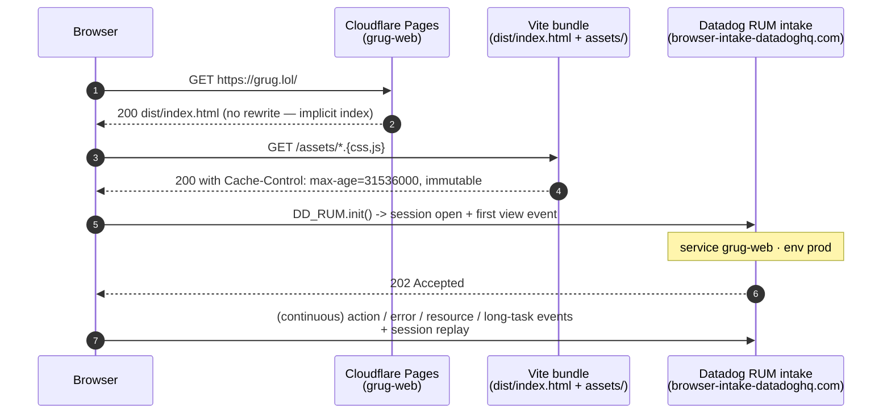
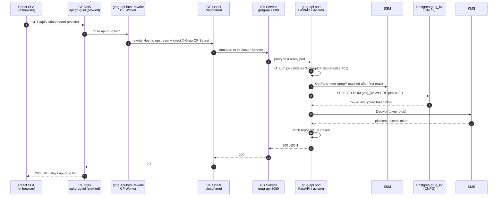
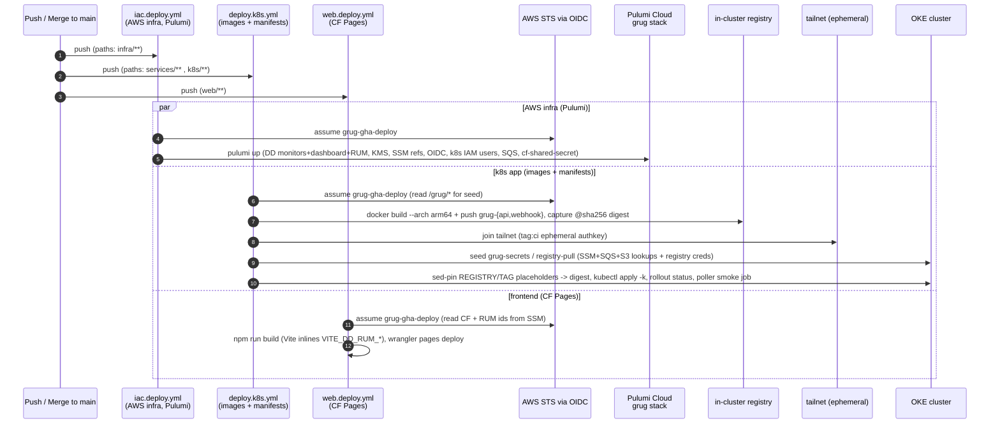

# Grug network topology

Mermaid's flowchart auto-layout produces overlapping edges on dense topologies — this doc uses **tables for static state** + **sequence diagrams for flows** (which render cleanly). Only the observability fan-out diagram (Section H) stays as a flowchart because the visual relationship is what's load-bearing.

> **Last meaningful update:** 2026-06-16 — rewritten for the self-hosting cutover (#354/#368). The backend left AWS Lambda for Kubernetes: `api.grug.lol` + `webhook.grug.lol` now resolve through a **Cloudflare tunnel** to in-cluster Services (not CF Workers + Lambda Function URLs), the store is **Postgres `grug_kv` (CNPG)** (not DynamoDB), and async work runs on a **SQS-fed consumer** (not SQS→Lambda event-source mappings). The `grug.lol` landing + SPA + RUM frontend is unchanged (still Cloudflare Pages).

External SaaS the stack depends on (flat dependencies, not topology):

- **Cloudflare Pages** — `grug-web` project at apex `grug.lol` (static landing + React SPA). Unchanged by the cutover.
- **Cloudflare DNS + Worker + tunnel** — proxied records for `api.grug.lol` + `webhook.grug.lol` hit the per-service `*-host-rewrite` Worker (injects `X-Grug-CF-Secret`, rewrites `Host` to the in-cluster upstream read from SSM `/grug/{api,webhook}-upstream-host`), then a `cloudflared` tunnel transports to the in-cluster Services. The Lambda Function URLs the Workers used to target are retired; the Workers themselves remain the auth-injection point (rollback = delete the SSM override → Workers revert to the Function URL).
- **AWS us-east-1** — SSM Parameter Store (secrets), SQS FIFO (async jobs), KMS CMK (OAuth-token envelope encryption), S3 (cave diff bucket). Lambda, Lambda Function URLs, and ECR are **gone**; the `grug-main` DynamoDB table still exists in Pulumi state but is **no longer the store** (the store is Postgres) — removing it is a separate destructive decision.
- **Datadog US1** — APM + Logs + LLM Observability + RUM + Monitors.
- **GitHub** — App registration (webhook source + OAuth identity provider) + Actions OIDC (deploys).
- **Pulumi Cloud** — `grug/{dev,prod}` stacks (AWS-side infra only; the k8s manifests are applied by the deploy workflow, not Pulumi).
- **OKE cluster + in-cluster registry** — private infra (the operator's homelab/cloud). Not addressable from this public repo; reached at deploy time over an ephemeral tailnet join.

---

## A. Public surfaces — what each domain serves

| Surface | DNS | CF layer | Origin | Purpose |
|---|---|---|---|---|
| **Landing + SPA** | `grug.lol` | CF Pages (`grug-web` project, static assets + `_redirects`) | — | Marketing landing (static `index.html`) + React SPA at `/app.html` for `/signin`, `/dashboard`, `/admin` |
| **User API** | `api.grug.lol` | CF DNS proxied → `grug-api-host-rewrite` Worker → CF tunnel (`cloudflared`) | k8s Service `grug-api:8080` → `grug-api` pod | OAuth callback, dashboard reads/writes, repo config CRUD, admin endpoints |
| **GitHub webhook** | `webhook.grug.lol` | CF DNS proxied → `grug-webhook-host-rewrite` Worker → CF tunnel (`cloudflared`) | k8s Service `grug-webhook:8080` → `grug-webhook` pod | GitHub App webhook receiver — installations, PRs, check runs |

The Worker + tunnel are the only inbound path; the NetworkPolicy (Section H) denies all other ingress to the pods. The CF shared-secret + HMAC/session layers (Section H) are the request-auth boundary regardless of the transport.

---

## B. Placement — what lives where

Two planes now: a **Kubernetes namespace** (`grug`) holding every runtime workload, and a thin set of **AWS resources** the pods consume at runtime.

### B.1 Kubernetes (`grug` namespace, OKE — private infra)

| Workload | Kind | Shape | Purpose |
|---|---|---|---|
| `grug-api` | Deployment (1 replica) | arm64, 50m/192Mi req, 512Mi limit, RollingUpdate `maxUnavailable:0` | FastAPI HTTP service for the dashboard/OAuth/admin. Serves `:8080`, `/livez` + dependency-aware `/readyz` (#404) |
| `grug-webhook` | Deployment (1 replica) | same shape; `GRUG_K8S_RUNTIME=1`, `GRUG_ELDER_DURABLE_QUEUE=1` | GitHub webhook receiver. ACKs in under 10s after persisting a snapshot-scoped Elder job with a 90-second settle duration to SQS |
| `grug-consumer` | Deployment (1 replica, Recreate) | no HTTP surface; `command: consumer.py`; deep Elder config; four rerun workers | Long-polls the SQS FIFO queues, runs quiet-window Elder reviews and explicit reruns, and answers `/grug ask`. Per-PR workload groups preserve local ordering while unrelated work runs concurrently |
| `grug-poller` | CronJob (`*/15`) | `poller_handler.handler` | Reaction poller (was an EventBridge-scheduled Lambda) |

One Dockerfile (`services/Dockerfile`, ARG SERVICE) builds two images: api runs its own, the rest share the webhook image (full dependency graph); only `command`/env differ. Shared hardening: `runAsNonRoot` (uid 10001), `readOnlyRootFilesystem`, `drop: [ALL]`, `automountServiceAccountToken:false` (the Smasher launcher SA is the exception, #469), arm64 `nodeSelector`, `imagePullSecrets: registry-pull`. Since #389 every workload derives AWS creds from its Roles Anywhere certificate (cert-manager leaf + aws_signing_helper credential_process).

In-cluster Secrets (seeded by the deploy workflow from SSM/SQS/S3 — never committed):

| Secret | Holds | Consumed by |
|---|---|---|
| `grug-secrets` | APP CONFIG ONLY (#389): `GRUG_DATABASE_URL`, `GRUG_KMS_CMK_ARN`, the three `*_QUEUE_URL`s, `GRUG_CAVE_DIFF_BUCKET` - NEVER AWS credentials (the deploy seed + every pod's boot proof both refuse them) | api / webhook / consumer / poller (`envFrom`) |
| `registry-pull` | in-cluster registry pull credential | all pods (`imagePullSecrets`) |

The pods do **not** carry app secrets (App key, OAuth secrets, LLM keys, CF shared secret): those are read from SSM **at runtime** via the `*_SSM` path env vars (`secrets_loader`), authorized by the pod's Roles Anywhere session (X.509 leaf -> aws_signing_helper -> STS; #389). `grug-secrets` carries only deploy-resolved app values that must not be committed (the queue URLs and CMK ARN embed the account id) - no credential of any kind.

### B.2 AWS us-east-1 (runtime dependencies)

| Resource | Name | Notes |
|---|---|---|
| SSM `/grug/*` | App ID, private key, webhook secret, OAuth client id+secret, session-signing secret, CF shared secret, KMS CMK ARN, database URL, DD RUM app id+token, prompt-experiment + fallback flags | SecureStrings; some Pulumi-managed (RUM ids), most hand-seeded (HITL prereqs) |
| SSM `/infra/llm/*` | `openrouter_api_key`, `poolside_api_key` | Elder LLM backends (shared infra namespace) |
| SQS FIFO | `grug-rerun-jobs.fifo`, `grug-cave-results.fifo`, `grug-cave-jobs.fifo` (+ DLQs) | `grug-rerun-jobs` carries snapshot-scoped Elder reviews, explicit reruns, and questions in separate bounded workload groups; failures redrive to a DLQ at `maxReceiveCount` |
| KMS CMK | `grug-tokens` | Envelope-encrypts user OAuth/credential blobs (`crypto/kms_envelope`). `grug-api` holds `kms:Decrypt`; webhook uses the GitHub App JWT instead |
| S3 | `grug-cave-diffs*` | Cave (self-hosted LLM) diff hand-off bucket |
| DynamoDB | `grug-main` | **Legacy — NOT the store.** Exists in Pulumi state; the store is Postgres `grug_kv`. Removal is a separate decision |
| IAM | `grug-gha-deploy` (OIDC role) + the `ra-grug` Roles Anywhere tenant role (infrastructure repo) | Deploy role reads `/grug/*` + the RA ARNs for the seed; pods assume `ra-grug` via X.509 (#389 - no IAM users remain) |

### B.3 Postgres (CNPG — private infra)

The single-table store `grug_kv(pk, sk, data jsonb, gsi1pk, gsi1sk, ttl)` lives on a **shared CloudNativePG cluster** in private infra (#354 store swap). Reached over the cluster network on `5432` via `GRUG_DATABASE_URL` (`psycopg`, lazy pool). DDB's lazy TTL became an explicit "skip expired rows on read" filter (Postgres has no TTL reaper).

---

## C. Landing-page request flow (`grug.lol/`) — unchanged



Routing rules live in `web/public/_redirects`. **Cardinal rule (learned PR #160):** destinations must NOT end in `.html` — CF Pretty URLs 308-canonicalizes the dest, converting the 200 rewrite into a 301 redirect. This frontend talks only to `api.grug.lol`; the backend migration did not touch it.

---

## D. User-API request flow (`api.grug.lol/api/v1/*`)



CORS: the api service allows `https://grug.lol` only (exact-origin required for `credentials: true`). Methods GET/POST/PUT/DELETE; headers content-type, authorization. The pod is stateless and horizontally identical; `uvicorn` serves concurrent requests (no per-invocation isolation like the old Lambda).

---

## E. GitHub-webhook request flow (`webhook.grug.lol/webhook/github`)

```mermaid
sequenceDiagram
    autonumber
    participant GH as GitHub<br/>App webhook emitter
    participant CFDNS as CF DNS<br/>webhook.grug.lol (proxied)
    participant Worker as grug-webhook-host-rewrite<br/>CF Worker
    participant Tunnel as CF tunnel<br/>cloudflared
    participant SVC as k8s Service<br/>grug-webhook:8080
    participant WH as grug-webhook pod
    participant PG as Postgres grug_kv
    participant SQS as SQS grug-rerun-jobs
    participant C as grug-consumer pod
    participant Pool as Poolside Laguna
    participant OR as OpenRouter Opus 4.7

    GH->>CFDNS: POST /webhook/github<br/>X-Hub-Signature-256: sha256=...
    CFDNS->>Worker: route webhook.grug.lol/*
    Worker->>Tunnel: rewrite Host to upstream + inject X-Grug-CF-Secret
    Tunnel->>SVC: transport to in-cluster Service
    SVC->>WH: proxy to a ready pod
    WH->>WH: cf_auth + HMAC-SHA256 verify body
    alt signature valid
        WH->>PG: read INST#<id> (allowlist check)
        PG-->>WH: allowlisted=true
        WH->>SQS: enqueue snapshot-scoped review<br/>settle_seconds=90
        WH-->>SVC: 200 (ACK < 10s)
        SQS-->>C: long-poll returns review job
        C->>GH: fetch current PR snapshot
        C->>PG: lease current base/head/title/body snapshot
        C->>C: wait 90s quiet window
        C->>GH: refetch current PR snapshot
        alt snapshot eligible and unchanged
            C->>GH: fetch immutable base...head diff
            C->>Pool: deep review pass
            C->>OR: deep review pass<br/>high-effort reasoning
            C->>C: merge + deduplicate findings
            C->>C: judge findings in bounded batches
            C->>GH: recheck full snapshot + eligibility
            alt snapshot still eligible and unchanged
                C->>GH: publish check-run + inline review
            else snapshot changed or PR ineligible
                C->>C: cancel before publication<br/>enqueue fresh eligible snapshot
            end
        else snapshot changed or PR ineligible
            C->>C: cancel stale job; publish nothing
            C->>SQS: enqueue freshly fetched eligible snapshot
        end
        C->>SQS: delete completed/stale message
    else signature invalid
        WH-->>SVC: 401
        Note over WH,SVC: DD monitor on sig-verify failures fires here
    end
    SVC-->>Tunnel: response
    Tunnel-->>CFDNS: response
    CFDNS-->>GH: response
```

The webhook never decrypts user tokens - it authenticates as the GitHub App (JWT signed with `/grug/github-app-private-key`). Elder's normal hot path is durable before the ACK, so either pod may restart without losing queued work. SQS visibility and ownership-token database leases renew during long reviews. The consumer supplies bounded, redacted intent and code/runtime context to both reviewers and the publication judge. `GRUG_REVIEW_DEPTH=deep` requires both review passes before completion; a one-backend result is provisional and retried. Write-authorized reactions train only real producer spans: confirmed findings become positive examples and false positives become AVOID guidance. The legacy in-process Elder worker is compatibility-only when `GRUG_ELDER_DURABLE_QUEUE` is absent or false.

---

## F. Async consumer flow (SQS → `grug-consumer`)

```mermaid
sequenceDiagram
    autonumber
    participant Q1 as SQS grug-rerun-jobs.fifo
    participant Q2 as SQS grug-cave-results.fifo
    participant C as grug-consumer pod<br/>(four rerun workers)
    participant PG as Postgres grug_kv
    participant GH as GitHub Checks API
    participant DLQ as SQS DLQ

    C->>Q1: ReceiveMessage (long poll)
    Q1-->>C: normal review or explicit rerun job (or empty)
    alt normal snapshot-scoped review
        C->>GH: fetch current PR
        C->>PG: acquire + renew snapshot lease
        C->>C: wait 90s; refetch
        C->>C: stable -> deep review; moved -> enqueue fresh + cancel
    else explicit operator/recovery rerun
        C->>C: dispatch persona on current head immediately
    end
    C->>GH: post check-run / review when dispatched
    alt success
        C->>Q1: DeleteMessage
    else unhandled failure
        Note over C,Q1: no delete -> visibility timeout -> redeliver
        Q1->>DLQ: after maxReceiveCount (terminal, visible signal)
    end
    C->>Q2: ReceiveMessage (dedicated cave-results worker)
    Q2-->>C: cave result -> post to GitHub
```

The consumer is both Elder's normal durable execution plane and the recovery
layer for explicit reruns. The SQS redrive contract retries a raised handler;
a persistent failure lands in the DLQ. Completed stale-head cancellations are
deleted normally because a newer webhook message owns the replacement work. A
watchdog (#405/#412) exits the process if a consumer thread dies so the kubelet
restarts the pod; `tracer.flush()` is bounded by
`DD_TRACE_AGENT_TIMEOUT_SECONDS=2` so a dead trace agent cannot stall it.

---

## G. Deploy plane — two control planes



**Public-repo discipline (load-bearing):** no infra identifiers are committed. The registry host arrives via `vars.DEPLOY_REGISTRY_HOST`, cluster + join creds via the `k8s-prod` environment secrets (`KUBECONFIG_B64`, `TS_AUTHKEY`, `REGISTRY_*`), and the manifests carry `REGISTRY_PLACEHOLDER`/`TAG_PLACEHOLDER` that the workflow rewrites at deploy time (a post-sed sentinel fails the deploy if any placeholder survives). Images deploy by **immutable `@sha256` digest**, not the mutable tag. `workflow_dispatch` is guarded to `main` so a manual run from any ref can't reach the environment secrets.

---

## H. Trust boundaries

| Boundary | Outside | Inside | Mechanism |
|---|---|---|---|
| **Public → CF** | Internet | Cloudflare edge | TLS termination + WAF / bot mgmt at CF tier |
| **CF → cluster** | CF Worker + tunnel | k8s Service `:8080` | The `*-host-rewrite` Worker injects `X-Grug-CF-Secret` (from its `GRUG_CF_SECRET` binding) and rewrites `Host` to the in-cluster upstream; a `cloudflared` tunnel transports it to the Service (the only inbound path — NetworkPolicy denies the rest). `services/{api,webhook}/cf_auth.py` validates the header via `hmac.compare_digest` on every non-`/livez` request — a request that bypasses the Worker has no valid header and gets 401. Secret in SSM `/grug/cf-shared-secret`; DD monitor on mismatch spikes |
| **Pod → AWS** | X.509 leaf (cert-manager Secret `grug-pki-tls`) | SSM / SQS / KMS / S3 | Roles Anywhere: 6h cert -> aws_signing_helper -> ~1h STS session as `ra-grug` (#389; no long-lived credential exists). Pod reads app secrets from SSM at runtime (not baked into the image) |
| **api pod → user OAuth tokens** | Postgres encrypted blob | plaintext access/refresh token | KMS envelope decrypt (`grug-tokens` CMK). Only the api path holds `kms:Decrypt`; the webhook uses the GitHub App JWT |
| **Webhook payload** | GitHub | grug-webhook handler | HMAC-SHA256 verify against `/grug/github-app-webhook-secret`; 401 on mismatch |
| **Namespace segmentation** | other tenants on the shared cluster | grug pods | NetworkPolicy: `default-deny-ingress` + `allow-http-ingress` (TCP 8080 to api/webhook only; consumer/poller stay sealed) + `allow-egress-scoped` (DNS 53, HTTPS 443, Postgres 5432, DD agent 8125/8126). **Only enforced if the cluster CNI is policy-capable** (e.g. Calico); harmless-but-inert otherwise |
| **k8s API access** | every other grug pod (none) | webhook/consumer via the Smasher launcher SA only (#469; perms live in the grug-trial namespace) | `automountServiceAccountToken:false` everywhere else |
| **User session** | Browser cookie | api handlers | Cookie issued by `/api/v1/auth/github/callback`, HMAC-signed with `/grug/session-signing-secret` (decoupled from the webhook secret). SameSite=Lax. CORS `allow_credentials=true` requires exact-origin `https://grug.lol` |

---

## I. Observability fan-out (the one diagram where the picture is the point)

```mermaid
flowchart LR
    API["grug-api pod"]
    WH["grug-webhook pod"]
    CON["grug-consumer pod"]
    POLL["grug-poller CronJob"]
    SPA["React SPA + static HTML<br/>(in browser)"]

    AGENT["node-local DD agent<br/>(DD_AGENT_HOST = status.hostIP)<br/>DogStatsD 8125 / APM 8126"]
    APM["DD APM + LLM Obs<br/>service:grug-api · grug-webhook<br/>grug-consumer · grug-poller<br/>ml_app:grug-elder"]
    LOGS["DD Logs<br/>(DD_LOGS_INJECTION, trace-correlated)"]
    RUM["DD RUM<br/>service:grug-web"]
    MON["DD Monitors (Pulumi)<br/>KSM workload-not-ready / crashloop /<br/>restart-spike / poller-unhealthy +<br/>SQS backlog + cave fallback"]

    API --> AGENT
    WH --> AGENT
    CON --> AGENT
    POLL --> AGENT
    AGENT -- traces --> APM
    AGENT -- logs --> LOGS
    SPA -- view / action / error + replay --> RUM
    MON -. watches kubernetes_state.* + logs .-> API

    classDef green fill:#1b5e20,stroke:#4caf50,stroke-width:2px,color:#fff
    classDef yellow fill:#f57f17,stroke:#ffc107,stroke-width:2px,color:#fff
    class APM,LOGS,RUM green
    class MON,AGENT yellow
```

| Pillar | Status | Notes |
|---|---|---|
| **APM traces** | live | `ddtrace` on every workload (FastAPI auto-instrument for the HTTP pods; `ddtrace-run` for consumer/poller). Spans reach the **node-local** agent at `DD_AGENT_HOST=status.hostIP` (set per pod — a missing value silently drops APM). `DD_VERSION` = the build SHA. Verify via trace metrics, not raw span search (`feedback_verify_apm_via_trace_metrics`) |
| **LLM Observability** | live | `DD_LLMOBS_ENABLED=true`, `DD_LLMOBS_ML_APP=grug-elder` on the LLM-calling workloads |
| **Logs** | live | `DD_LOGS_INJECTION=true` correlates `trace_id`/`span_id`; service/env/version tags from the deploy |
| **Monitors** | live | Pulumi-managed (`components/dd_monitors.py`), scoped `kube_namespace:grug`: KSM workload-not-ready / crashloop / restart-spike / poller-cronjob-unhealthy (#406) + SQS backlog + cave-fallback. Routed to the operator's Discord alert channel |
| **RUM** | live | Frontend `service:grug-web` (unchanged). App id + client token in SSM, Pulumi-registered (`dd_rum`) |

---

## J. Bridge components (load-bearing single points of failure)

| Component | Why load-bearing |
|---|---|
| CF `*-host-rewrite` Workers + tunnel (`cloudflared`) | The ONLY inbound path to `api`/`webhook`. The Workers are the auth-injection point (`X-Grug-CF-Secret`) + Host-rewrite; the tunnel is the transport. Either down = both public surfaces 5xx (the NetworkPolicy blocks every other ingress). Workers managed out-of-band via `infra/cloudflare/deploy.sh` (pulumi-cloudflare WorkerScript has idempotency bugs); the tunnel runs in private infra |
| `grug-tokens` KMS CMK | Envelope-encrypts every user OAuth/credential blob; the api OAuth callback 500s without `kms:Decrypt` on it (`GRUG_KMS_CMK_ARN` must be in the pod secret — its omission is exactly what broke first-sign-in once) |
| Postgres `grug_kv` (CNPG) | The store. Unreachable on 5432 = `/readyz` fails (#404), rollouts stall on the last-good pod, every dashboard/webhook read errors |
| in-cluster registry + `registry-pull` Secret | Every pod pulls its image from here. A bad/expired pull credential = `ImagePullBackOff` cluster-wide for grug |
| `grug-secrets` seed (deploy workflow) | Carries the AWS credential that authorizes all runtime SSM reads + the DB URL + queue URLs. A broken seed outages every pod — the workflow fails the deploy on any empty/`None` value before the destructive secret re-create |
| cert-manager / pki-intermediate | Issues + renews the 6h `grug-pki` leaf every workload's AWS access rides on (#389). A stuck renewal crashes pods loud (boot proofs) and pages via the credential monitor |
| `grug-gha-deploy` IAM role | OIDC-trust-scoped to the repo; reads `/grug/*` for the seed and runs `pulumi up`. Both deploy planes depend on it |

---

## K. Bootstrap order (cold-start, if rebuilding from zero)

See `docs/SELF_HOST.md` + `docs/HITL_PREREQUISITES.md` for the full operator runbook. In brief:

1. **Manual SSM pre-load** — every `/grug/*` parameter the pods read at runtime (App id/key/secret, OAuth client id+secret, webhook secret, session-signing secret, CF shared secret, KMS CMK ARN, database URL) plus `/infra/llm/*` LLM keys and `/infra/datadog/*` keys.
2. **`pulumi up`** (`iac.deploy.yml`) — creates the AWS-side infra: SSM references, KMS CMK, OIDC role, SQS FIFO queues + DLQs, S3 cave bucket, DD monitors/dashboard/RUM app. (DynamoDB `grug-main` still exists here as legacy.)
3. **Provision Postgres** — the `grug_kv` table on the shared CNPG cluster; put its DSN in `/grug/database-url`.
4. **Stand up the CF edge** — a `cloudflared` tunnel to the in-cluster Services; set `/grug/{api,webhook}-upstream-host` to the tunnel hostnames and `/grug/cf-shared-secret`; deploy the `*-host-rewrite` Workers via `infra/cloudflare/deploy.sh` (binds the routes, injects the secret, points upstream at the tunnel host).
5. **First `deploy.k8s.yml` run** — builds + pushes the arm64 images, joins the tailnet, seeds the three Secrets, applies `k8s/` by digest, waits on rollout + the poller smoke job.
6. **First `web.deploy.yml` run** — builds + `wrangler pages deploy` the `grug-web` CF Pages project (with RUM ids from SSM).
7. **GitHub App registration** — create/point the App: webhook URL `https://webhook.<domain>/webhook/github`, setup URL `https://<domain>/dashboard`; copy the App id + private key into SSM (step 1).

---

## L. Cross-references

- [`docs/RUNBOOK.md`](RUNBOOK.md) — operational procedures (deploy, secret rotation, failure modes, DR) for the live k8s runtime
- [`docs/SELF_HOST.md`](SELF_HOST.md) — end-to-end self-hosting setup
- [`docs/HITL_PREREQUISITES.md`](HITL_PREREQUISITES.md) — every SSM parameter that must exist before first deploy
- [`docs/CUTOVER.md`](CUTOVER.md) — the Lambda → k8s migration record
- [`k8s/`](../k8s/) — the manifests this doc describes (`networkpolicy.yaml` is the authoritative segmentation)
- The operator's private infra repo holds the cluster-topology + cross-tenant Pulumi-project graph (not linked from this public repo)

---

## Updating this doc

When a new public surface, workload, or cross-tier edge lands:
1. Add a row to **A** (public surfaces), **B.1** (k8s workloads), or **B.2** (AWS resources).
2. If it changes a flow, update the relevant sequence diagram in **C / D / E / F / G**.
3. If it adds or moves a trust boundary, update **H** (and `k8s/networkpolicy.yaml` if it changes segmentation).
4. If it adds a single point of failure for multiple surfaces, append to **J**.
5. If observability changes (new service tag, new monitor, new RUM event type), update **I** — both the diagram AND the matrix.
